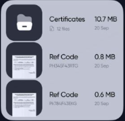
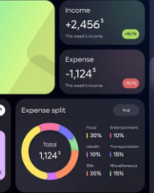
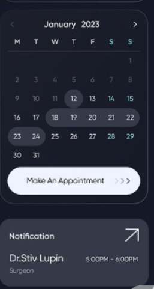
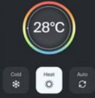
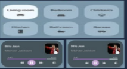
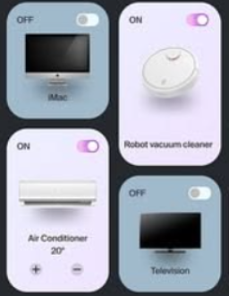
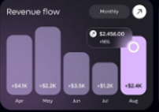

# Guia 5

Layout Julia

GERAL

Fundo: \#1F2C43  
Barra de abas lateral, ocupando o mínimo espaço possível da tela  
  
todos os botoes devem ter a mesma estetica em todas as telas

BOTÕES (de todas as telas)

Filtros: no topo  
botão incluir atividade ou execução ao lado direito dos filtros  

dados gerais: lado esquerdo  

status atividades ao centro e ao lado de dados gerais  

calendario à esquerda  
filtros abaixo do calendario  
atividades abaixo dos filtros

prioridade ao lado esquerdo  

propostas ao centro

atividade X empresa à esquerda \+ tipo de produto serviço \+ produtos/serviços vinculados

visao geral ocupando a tela toda e ao final da pagina

* 

DASHBOARD:

1. Barra de abas no topo  
2. Filtros no topo
